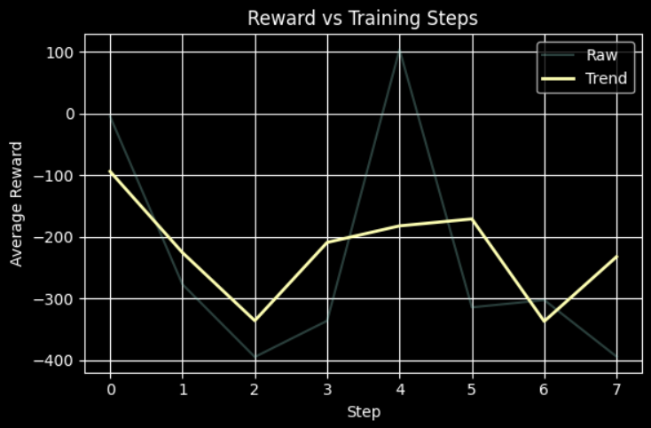

# 🕵️ Adaptive Fraud Audit Arena: Reasoning Under Unreliable Information

Most environments evaluate whether an agent can reach a correct answer.

This environment explores a different question:

> **How does an agent behave when the information itself is unreliable?**

---

## 🧭 The Setup

The agent acts as an auditor investigating fraud across departments.

At each step, it can:

* interact with multiple sources
* query a database
* submit a final decision

The objective is to identify the root cause within a limited budget.

---

## ⚠️ Conflicting Signals

Different sources may disagree:

* CFO may point to one department
* Whistleblower may point to another

This forces the agent to evaluate consistency over time rather than relying on a single signal.

---

## 🛠️ Imperfect Tools

The database provides structured outputs, but:

* some results may be noisy
* some may be misleading

The agent must interpret outputs rather than treating them as ground truth.

---

## 🧠 Explicit Reasoning State

The environment exposes reasoning through:

* belief distribution
* entropy (uncertainty)
* conflict score

This allows tracking how the agent’s understanding evolves.

---

## 🔁 Dynamic Environment

The underlying structure can change during an episode.

* relationships may shift
* prior conclusions may become outdated

The agent must adapt its reasoning accordingly.

---

## ⚙️ What the Agent Must Learn

The agent must:

* compare conflicting signals
* manage uncertainty
* maintain consistent beliefs
* decide when to commit

This goes beyond simple prediction.

---

## 📊 Training Signal

Training produces non-trivial learning dynamics.

Below is a reward curve from early training:

Key observations:

* rewards start strongly negative
* variance is high
* improvement is gradual

This reflects the difficulty of learning stable reasoning under uncertainty.

---

## 🔍 Key Observation

The agent does not immediately learn correct answers.

Instead, it first learns to:

* reduce contradictions
* stabilize belief updates
* avoid misleading signals

---

## 🧠 Why This Matters

Many real-world systems operate under:

* incomplete information
* conflicting sources
* changing conditions

AFAA provides a controlled environment to study such behavior.

---

## 🏁 Summary

> **Reliable decisions require reasoning—not just prediction.**

---

## 🔗 Links

* Hugging Face Space: https://huggingface.co/spaces/sharad0x/openenv-afaa-gym
* README: https://github.com/sharad0x/Sovereign-SRE-Gym/blob/main/README.md
* Repository: https://github.com/sharad0x/Sovereign-SRE-Gym
