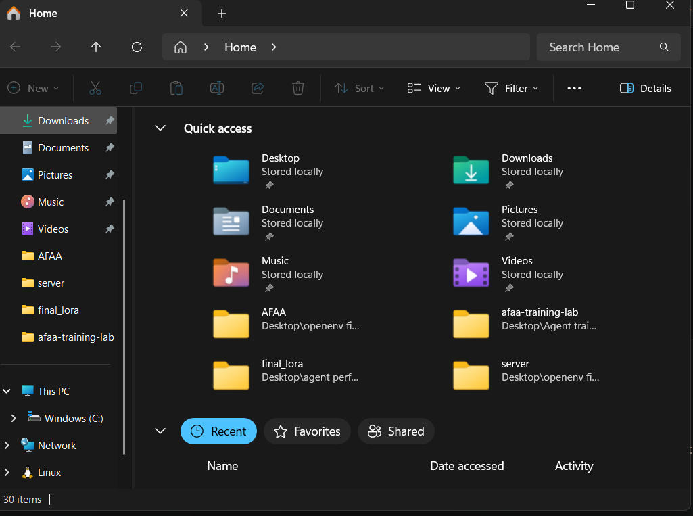

# 🕵️ Adaptive Fraud Audit Arena: Reasoning Under Unreliable Information

Most environments evaluate whether an agent can reach a correct answer.

This environment explores a different question:

> **How does an agent behave when the information itself is unreliable?**

---

## 🧭 The Setup

The agent acts as an auditor investigating fraud across departments.

At each step, it can:

* interact with multiple sources
* query a database
* submit a final decision

The objective is to identify the root cause within a limited budget.

---

## ⚠️ Conflicting Signals

In AFAA, different sources may disagree.

* CFO may point to one department
* Whistleblower may point to another
* both may appear confident

👉 This forces the agent to evaluate multiple signals instead of relying on one.

---

## 🛠️ Imperfect Tools

The database provides structured signals, but:

* some outputs may be noisy
* some may be misleading

👉 The agent must interpret signals, not blindly trust them.

---

## 🧠 Explicit Reasoning State

The environment tracks reasoning directly through:

* belief distribution
* entropy (uncertainty)
* conflict score

👉 This allows measurement of how reasoning evolves over time.

---

## 🔁 Dynamic Environment

The underlying structure can change during an episode.

* relationships may shift
* prior conclusions may become outdated

👉 The agent must adapt its reasoning.

---

## ⚙️ What the Agent Must Learn

The agent must:

* compare conflicting signals
* manage uncertainty
* maintain consistent beliefs
* decide when to commit

This goes beyond simple prediction.

---

## 🔍 Behavior Before Training

Before training, the agent:

* follows the most recent signal
* frequently changes its hypothesis
* ignores inconsistencies

👉 Behavior is unstable and reactive.

---

## 📈 Behavior After Training

After training, the agent:

* cross-checks signals
* stabilizes belief updates
* reduces uncertainty
* converges faster

---

## 📊 Observed Training Signals

Early training shows:

* strongly negative rewards
* high variance between episodes
* gradual improvement over time

👉 The agent first learns to reduce poor reasoning before improving outcomes.

---

## 🔍 Key Observation

The agent does not immediately learn correct answers.

Instead, it first learns to:

* reduce contradictions
* avoid misleading signals
* stabilize belief updates

This intermediate phase is critical for reasoning under uncertainty.

---

## 🧠 Why This Matters

Many real-world scenarios involve:

* incomplete information
* conflicting sources
* changing systems

AFAA provides a controlled environment to study agent behavior under these conditions.

---

## 🏁 Summary

> **Not all signals are trustworthy. Good decisions require reasoning, not just prediction.**

---

## 🔗 Links

* Hugging Face Space: https://huggingface.co/spaces/sharad0x/openenv-afaa-gym
* README: [readme](https://github.com/sharad0x/Sovereign-SRE-Gym/blob/main/README.md)
* Repository: https://github.com/sharad0x/Sovereign-SRE-Gym
